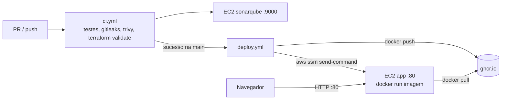

# Delivery Pipeline Design

**Spec**: `.specs/features/delivery-pipeline/spec.md`
**Status**: Draft

Constraints: AD-001 (público, sem login), AD-005 (Learner Lab), AD-007 (2 EC2, simples).

---

## Architecture Overview



Uma imagem Docker só: o Go serve `/healthz` e os arquivos do React. A EC2 `app` roda essa imagem. O deploy é um `docker pull` + `docker run` enviado pelo SSM.

```
backend/              Go (cmd/api, internal/httpapi)
frontend/             Vite + React + TS
Dockerfile            node build → go build → distroless nonroot
infra/                Terraform: 2 EC2, 2 SG, 2 EIP (estado local, gitignored)
.github/workflows/    ci.yml, deploy.yml
scripts/              refresh-aws-secrets.sh
sonar-project.properties
```

---

## Code Reuse Analysis

### Existing Components to Leverage

| Component | Location | How to Use |
| --------- | -------- | ---------- |
| `LabInstanceProfile` | IAM da conta | `iam_instance_profile` das EC2 (dá o SSM agent registrado) |
| VPC/subnet default | conta AWS | `data "aws_vpc" "default"` |
| AMI Amazon Linux 2023 | SSM public parameter | `data "aws_ssm_parameter"` `/aws/service/ami-amazon-linux-latest/al2023-ami-kernel-default-x86_64` (SSM agent já vem instalado) |

### Integration Points

| System | Integration Method |
| ------ | ------------------ |
| AWS | `aws-actions/configure-aws-credentials` com 3 secrets do lab; `APP_INSTANCE_ID` e `APP_URL` como variables do repo |
| GHCR | `docker/login-action` com `GITHUB_TOKEN` (`packages: write` só no job de deploy); pacote público |
| SonarQube | variable `SONAR_HOST_URL`, secret `SONAR_TOKEN`, scanner com `sonar.qualitygate.wait=true` |

---

## Components

### Backend (`backend/`)

- `internal/httpapi.NewRouter(webDir string) http.Handler`: `GET /healthz`, 404 em `/api/`, arquivo estático ou fallback para `index.html`.
- `cmd/api.run(ctx, getenv, ready) error`: lê `PORT`/`WEB_DIR` e faz shutdown gracioso de 10 s. `main` só conecta os sinais.
- Só stdlib.

### Frontend (`frontend/`)

- `App` + `useHealth()` → `loading | online | offline`, com `fetch('/healthz')`.
- Proxy do Vite dev para `:8080`.

### Dockerfile

- `node:22-alpine` (build do front) → `golang:1.24-alpine` (`CGO_ENABLED=0`) → `gcr.io/distroless/static-debian12:nonroot`.
- `ENV PORT=8080 WEB_DIR=/web`, `EXPOSE 8080`, `USER nonroot`.

### Terraform (`infra/`)

- `aws_security_group.app`: ingress 80 de 0.0.0.0/0; egress liberado.
- `aws_security_group.sonar`: ingress 9000 de 0.0.0.0/0; egress liberado. Os runners do GitHub não têm IP fixo.
- `aws_instance.app`: t3.micro, `LabInstanceProfile`, IMDSv2 obrigatório, root 8 GB gp3 criptografado. `user_data` instala Docker e `systemctl enable --now docker`.
- `aws_instance.sonar`: t3.medium, root 30 GB criptografado. `user_data` instala Docker, `sysctl vm.max_map_count=524288` (persistido) e `docker run -d --restart unless-stopped -p 9000:9000 -v sonar_data:/opt/sonarqube/data sonarqube:community`.
- `aws_eip` para cada instância.
- Outputs: `app_url`, `app_instance_id`, `sonar_url`.
- `.trivyignore` justificando só o ingress público (80/9000) e HTTP.

### `ci.yml`

Dispara em `pull_request` para `main` e `push` na `main`. `concurrency` cancela o run anterior da mesma ref. `permissions: contents: read`.

| Job | Passos |
| --- | ------ |
| `backend` | setup-go, golangci-lint, `go test -coverprofile=coverage.out`, upload do artefato |
| `frontend` | setup-node, `npm ci`, lint, typecheck, `vitest run --coverage` (lcov), build, upload do artefato |
| `secrets` | checkout `fetch-depth: 0`, gitleaks |
| `deps` | `trivy fs` HIGH,CRITICAL, exit-code 1 |
| `image` | `docker build`, `trivy image --ignore-unfixed` HIGH,CRITICAL |
| `iac` | setup-terraform, `fmt -check`, `init -backend=false`, `validate`, `trivy config infra` |
| `sonar` | `needs: [backend, frontend]`, baixa a cobertura, roda o sonarqube-scan-action com `qualitygate.wait=true`; `if:` não é fork |

### `deploy.yml`

- Trigger: `workflow_run` quando o `ci` termina `completed` na `main`. `if: conclusion == 'success'`. `concurrency: deploy` sem cancelamento.
- `permissions: contents: read, packages: write`.
- Passos:
  1. Checkout do `head_sha`.
  2. Login no GHCR, build e push de `ghcr.io/<owner>/ssdlc-example:<sha>`.
  3. Configura credenciais AWS e roda `aws sts get-caller-identity`; se falhar, a mensagem fixa da CD-01 AC6.
  4. `aws ssm send-command --document-name AWS-RunShellScript` com: `docker pull IMG && (docker rm -f app || true) && docker run -d --name app --restart unless-stopped -p 80:8080 IMG`. O pull vem primeiro: se falhar, o container antigo continua rodando.
  5. `aws ssm wait command-executed`; se o status não for `Success`, falha e imprime o stderr.
  6. `curl -fsS $APP_URL/healthz` a cada 10 s, por até 3 min.

---

## Data Models (if applicable)

`GET /healthz` → `{"status":"ok"}`. Sem persistência.

---

## Error Handling Strategy

| Error Scenario | Handling | User Impact |
| -------------- | -------- | ----------- |
| `/healthz` falha no navegador | `useHealth` → offline | "API indisponível" |
| Credenciais do lab expiradas | Step de `sts` falha com mensagem fixa | Rodar o script de refresh e dar re-run |
| `docker pull` falha | Comando encadeado com `&&` para antes do `rm` | Container anterior continua no ar |
| Lab parado (EC2 desligadas) | SSM/Sonar falham → job vermelho | Iniciar o lab e dar re-run |

---

## Risks & Concerns

| Concern | Location (file:line) | Impact | Mitigation |
| ------- | -------------------- | ------ | ---------- |
| Credenciais do lab coladas no chat | conversa de 2026-09-16 | Expiram em ~4h | Nunca versionadas; só no profile local `ssdlc` e secrets; gitleaks no CI |
| Secrets com poder amplo num repo público | GitHub | Uso indevido por workflow alterado | Secrets não chegam a forks; jobs com AWS só em `main`/PR do mesmo repo; actions fixadas por SHA |
| HTTP sem TLS, token do Sonar em texto claro | `infra/` | Token interceptável | Aceito (trabalho acadêmico); o token só permite análise; registrado no `.trivyignore` |
| Senha padrão `admin/admin` do Sonar exposta | EC2 sonar | Tomada do servidor | Trocar a senha logo após o primeiro boot (T14), antes de publicar a URL |
| SonarQube com H2 | EC2 sonar | Não suportado em produção; sem upgrade | Aceito para o trabalho |
| SSM agent pode demorar a registrar após o boot | EC2 app | 1º deploy falha | T14 verifica `aws ssm describe-instance-information` antes do deploy |
| Tags anotadas de actions | workflows | SHA errado | Resolver com `git ls-remote <repo> 'refs/tags/<tag>^{}'` |
| Docker Desktop parado localmente | máquina | Gate de imagem local | Usar o job `image` do CI (T10) como gate se o Docker não subir |

---

## Tech Decisions (only non-obvious ones)

| Decision | Choice | Rationale |
| -------- | ------ | --------- |
| Registry | GHCR | Sem ECR; o push usa só o `GITHUB_TOKEN` |
| Deploy na EC2 | SSM send-command | Sem SSH/chaves/porta 22 |
| Estado Terraform | Local | CI não aplica infra; menos peças |
| Scanners | gitleaks + Trivy (fs, image, config) | 2 ferramentas cobrem segredos, deps, imagem e IaC |
