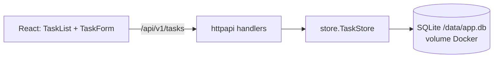

# Task Time Tracking Design — Fatia 1 (CRUD de tarefas)

**Spec**: `.specs/features/task-time-tracking/spec.md`
**Status**: Draft

Escopo desta fatia: histórias "Cadastrar e gerenciar tarefas" (P1) e "Arquivar e restaurar tarefas" (P2). Cronômetro e apontamentos ficam para a fatia 2.

Constraints ativos: AD-001 (sem login, público), AD-003 (arquivar em vez de excluir), AD-007 (uma EC2, container Docker simples).

---

## Architecture Overview



A API ganha uma camada `store` fina sobre SQLite. O handler traduz HTTP para chamadas do store e cuida de validação e códigos de erro. O React consome `/api/v1/tasks` na mesma origem, sem CORS.

---

## Code Reuse Analysis

| Component | Location | How to Use |
| --------- | -------- | ---------- |
| `NewRouter(webDir)` | `backend/internal/httpapi/router.go` | Ganha um parâmetro com as rotas de tarefas; mantém healthz, 404 de `/api/` e fallback SPA |
| `run(ctx, getenv, ready)` | `backend/cmd/api/main.go` | Passa a ler `DB_PATH` e abrir o banco antes de montar o router |
| Padrão de teste `httptest` | `backend/internal/httpapi/*_test.go` | Mesmo estilo para os handlers novos |
| `useHealth` | `frontend/src/useHealth.ts` | Padrão de hook com `fetch` reaproveitado em `useTasks` |
| `deploy.yml` (SSM `docker run`) | `.github/workflows/deploy.yml` | Acrescenta `-v ssdlc_data:/data -e DB_PATH=/data/app.db` |

---

## Components

### `backend/internal/store`

- **Purpose**: Persistência das tarefas em SQLite.
- **Driver**: `modernc.org/sqlite` (Go puro). Obrigatório: a imagem final é distroless *static* e `CGO_ENABLED=0`, então `mattn/go-sqlite3` não serve.
- **Interfaces**:
  - `Open(path string) (*Store, error)` — abre com `_pragma=journal_mode(WAL)` e `_pragma=busy_timeout(5000)`, roda a migração e devolve o store.
  - `Create(ctx, title, description string) (Task, error)`
  - `List(ctx, filter Filter) ([]Task, error)` — `Filter{Status string, Archived bool, Limit, Offset int}`
  - `Get(ctx, id string) (Task, error)` — `ErrNotFound` quando não existe
  - `Update(ctx, id string, p Patch) (Task, error)` — `Patch` com ponteiros para title/description/status
  - `SetArchived(ctx, id string, archived bool) (Task, error)`
- **Erros**: `ErrNotFound`, `ErrArchived` (editar tarefa arquivada), `ErrValidation` (campo + mensagem).

### Schema

```sql
CREATE TABLE IF NOT EXISTS tasks (
  id          TEXT PRIMARY KEY,
  title       TEXT NOT NULL,
  description TEXT NOT NULL DEFAULT '',
  status      TEXT NOT NULL CHECK (status IN ('todo','in_progress','done')),
  archived    INTEGER NOT NULL DEFAULT 0 CHECK (archived IN (0,1)),
  created_at  TEXT NOT NULL,
  updated_at  TEXT NOT NULL
);
CREATE INDEX IF NOT EXISTS idx_tasks_archived_updated ON tasks(archived, updated_at DESC);
```

`id` é UUIDv4 gerado na aplicação; datas em RFC 3339 UTC.

### `backend/internal/httpapi` — rotas de tarefas

| Método e rota | Sucesso | Erros |
| ------------- | ------- | ----- |
| `POST /api/v1/tasks` | 201 + tarefa | 422 `VALIDATION_ERROR`, 400 `INVALID_JSON` |
| `GET /api/v1/tasks?status=&archived=&page=` | 200 + lista | 422 em filtro inválido |
| `PATCH /api/v1/tasks/{id}` | 200 + tarefa | 404 `TASK_NOT_FOUND`, 409 `TASK_ARCHIVED`, 422 |
| `POST /api/v1/tasks/{id}/archive` | 200 + tarefa | 404 |
| `POST /api/v1/tasks/{id}/restore` | 200 + tarefa | 404 |

Formato de erro (spec): `{"error":{"code":"...","message":"...","fields":{...}}}`. Corpo acima de 1 MB → 413. Roteamento com padrões da stdlib (`POST /api/v1/tasks/{id}/archive`), sem framework.

### `frontend/src`

- `api/tasks.ts`: funções tipadas de fetch (`listTasks`, `createTask`, `updateTask`, `archiveTask`, `restoreTask`).
- `useTasks.ts`: estado da lista, criação, mudança de status, arquivar/restaurar, com `loading` e `error`.
- `TaskList.tsx` e `TaskForm.tsx`: lista com título, status (select) e botão arquivar; formulário com título e descrição; alternância "mostrar arquivadas"; mensagens de erro por campo vindas do 422.

### Container

- `Dockerfile`: criar `/data` já com dono `nonroot` (`COPY --from=... --chown=nonroot:nonroot` de um diretório vazio), porque a imagem distroless não tem shell para `mkdir`, e o volume herda a permissão do diretório da imagem. `ENV DB_PATH=/data/app.db`.
- `deploy.yml`: `docker run ... -v ssdlc_data:/data -e DB_PATH=/data/app.db`.

---

## Data Models

```typescript
interface Task {
  id: string
  title: string
  description: string
  status: 'todo' | 'in_progress' | 'done'
  archived: boolean
  created_at: string  // RFC 3339 UTC
  updated_at: string
}
```

---

## Error Handling Strategy

| Cenário | Tratamento | Impacto |
| ------- | ---------- | ------- |
| Título vazio ou > 200 | 422 com `fields.title` | Campo destacado no formulário |
| Status inválido | 422 com `fields.status` | Select não permite, mas a API valida mesmo assim |
| Editar tarefa arquivada | 409 `TASK_ARCHIVED` | Mensagem "tarefa arquivada" |
| Banco indisponível/corrompido | 503 `SERVICE_UNAVAILABLE`; `/healthz` passa a checar `db.PingContext` | Página mostra "API indisponível" |
| SQLite ocupado | `busy_timeout` 5s absorve; depois vira 503 | Raro com um usuário |

---

## Risks & Concerns

| Concern | Location | Impact | Mitigation |
| ------- | -------- | ------ | ---------- |
| Driver CGO quebraria a imagem estática | `Dockerfile:runtime` | Build falha ou binário não roda | `modernc.org/sqlite` (Go puro); T1 confirma com `CGO_ENABLED=0` |
| Volume montado como root x container nonroot | `Dockerfile`, `deploy.yml` | API não escreve no banco | `/data` na imagem já pertence a nonroot; T3 valida escrevendo de verdade |
| `docker rm -f app` sem volume nomeado apagaria os dados | `deploy.yml` | Perda de dados a cada deploy | Volume nomeado `ssdlc_data`; T3 valida com dois deploys seguidos |
| Dependência nova entra no scan do Trivy | `backend/go.sum` | CI pode ficar vermelho | Usar versão atual do driver; conferir no gate antes do PR |
| API pública sem rate limit | `httpapi` | Abuso e custo | Fora desta fatia (spec já registra como assumption); não inventar escopo |
| Cobertura do código novo < 80% reprova o quality gate | Sonar | PR vermelho | Testes de store e handlers cobrindo todos os ACs, escritos junto com o código |

---

## Tech Decisions

| Decision | Choice | Rationale |
| -------- | ------ | --------- |
| Driver SQLite | `modernc.org/sqlite` | Go puro, compatível com `CGO_ENABLED=0` e distroless static |
| Migração | `CREATE TABLE IF NOT EXISTS` no start | Uma tabela; ferramenta de migração seria peso morto aqui |
| Roteamento | Padrões da stdlib (Go 1.22+) | Sem framework, coerente com o que já existe |
| Paginação | `page` com 50 fixos | Spec; evita resposta ilimitada |
| ID | UUIDv4 via `crypto/rand` local | Evita dependência nova só para gerar id |
